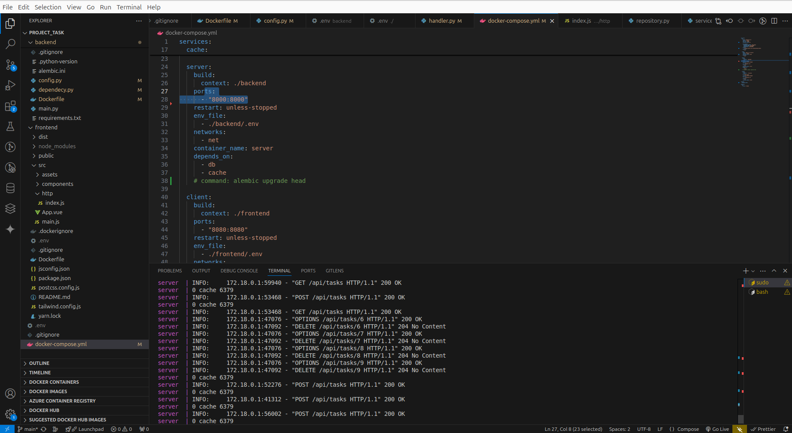
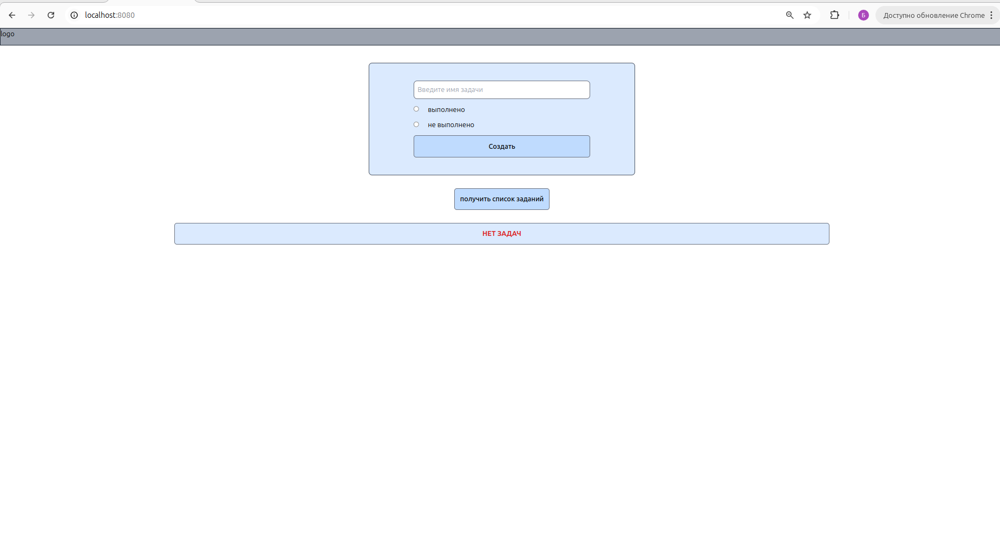
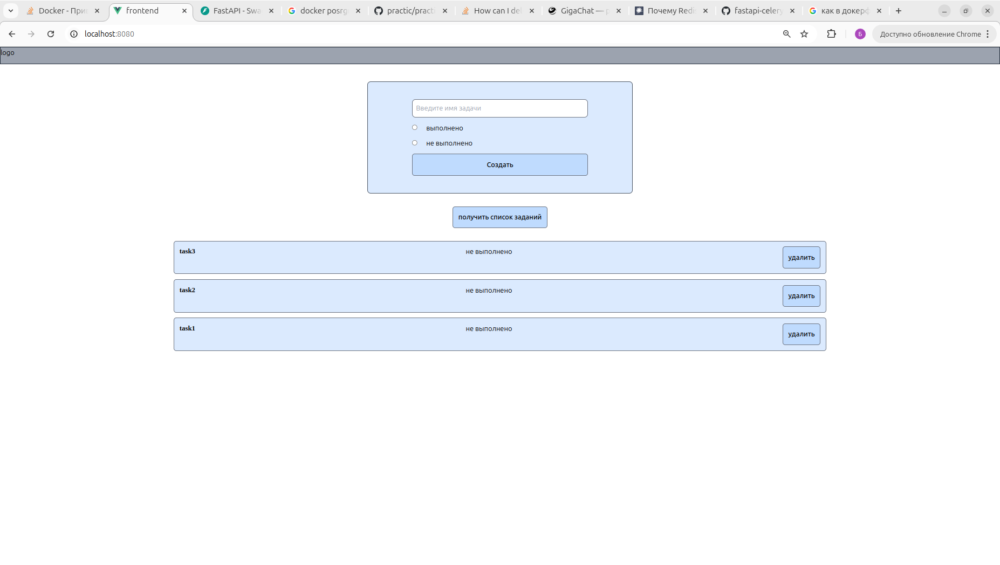

# Fulstack project Fastapi postgresql redis Vue.js tailwindcss

## Table of Contents

## About <a name = "about"></a>

Выполнение тестового задания

## Getting Started <a name = "getting_started"></a>

```
git clone https://github.com/bulat-nitaliev/fullstack_task.git
```

```
cd fullstack_task
```

### Installing

```
sudo docker compose up --build -d
```

```
sudo docker compose exec -it server sh
```

```
alembic upgrade head
```






